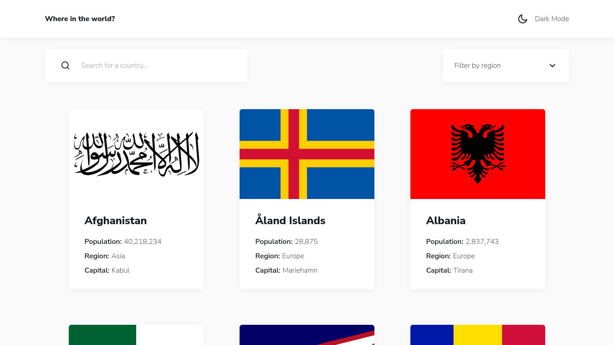
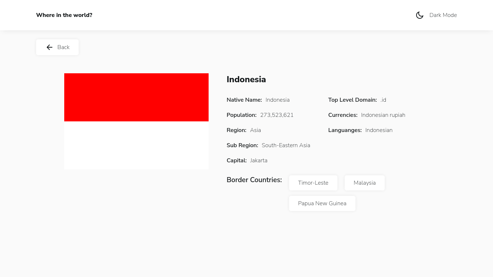
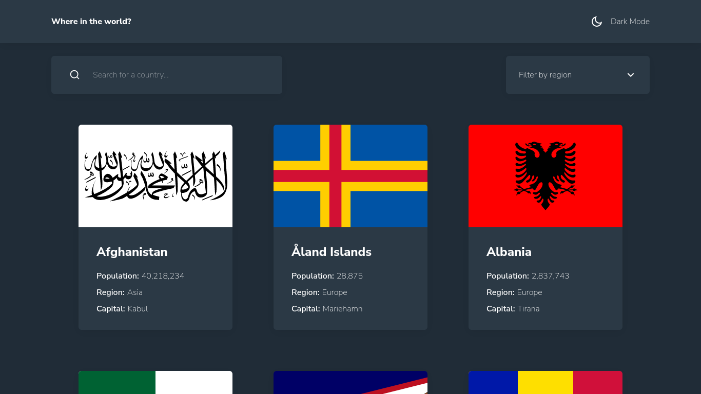

# Frontend Mentor - REST Countries API with color theme switcher solution

This is a solution to the [REST Countries API with color theme switcher challenge on Frontend Mentor](https://www.frontendmentor.io/challenges/rest-countries-api-with-color-theme-switcher-5cacc469fec04111f7b848ca). Frontend Mentor challenges help you improve your coding skills by building realistic projects. 

## Overview

### Screenshot

### Links

- [Repository](https://your-solution-url.com)
- [Live preview](https://your-live-site-url.com)

## My process

### Features
- Show all countries
- Show detail country
- Show countries by region
- Search country by name
- Toggle dark mode

### Framework / Library / Tools used

- React
- React Router Dom
- Redux, Redux Toolkit
- SASS / SCSS
- React Redux Loading Bar
- Eslint
- CSS Matic
- Favicon Generator from Dan's Tools

### Useful Resources

- Google Fonts
- Remix Icons
- Readme.so

## Author

- Website - [Arzaqul Mughny](https://www.zaarza.github.io)
- Frontend Mentor - [@zaarza](https://www.frontendmentor.io/profile/zaarza)

